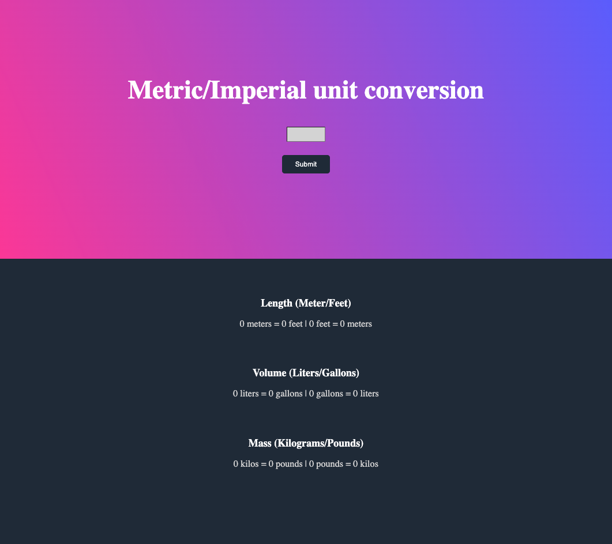

# unit-converter

An application with a simple, yet elegant user interface that takes in a number from the user and does unit conversions. It performs simple validations to ensure the input field is not empty and will display a message to the user to enter a number if it's left blank.

Upon clicking submit, the conversions are performed and the input field is reset.
